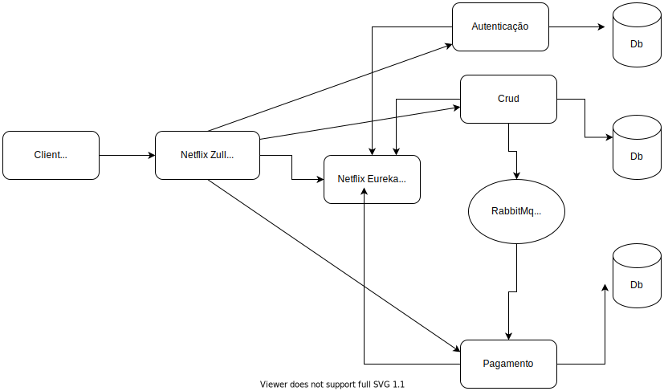

# Exemplo Microserviços com Spring Boot
## Event-driven Architecture (EDA) em uma Arquitetura de Microsserviços

1. Microserviços : Autenticação, Cadastro de Produto e Pagamento.
2. Framework: Spring Boot.
3. Mensagem: RabbitMq.
4. Service Discovery: Netflix Eureka.
5. Api Gateway Proxt: Netflix Zull Routing.

{:height="700px" width="400px"}

 

